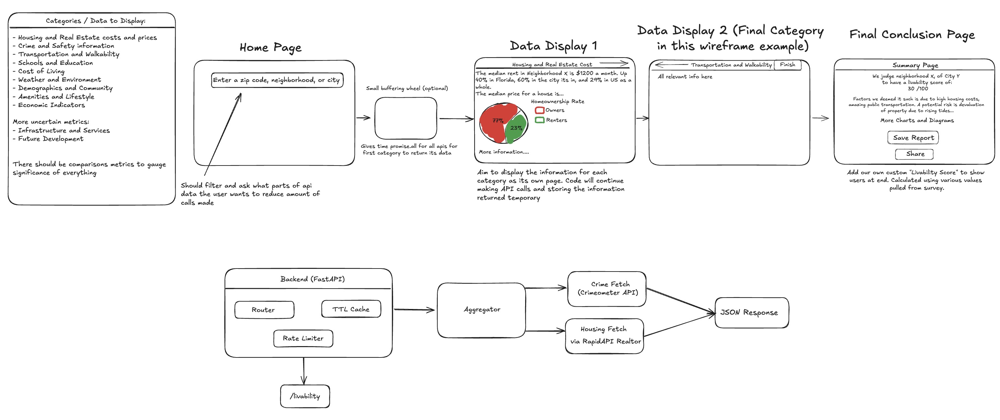

# Neighbor Metric
A comprehensive web application that helps people make informed decisions when relocating by providing detailed livability scores and comparisons for cities and neighborhoods across multiple key factors including safety, housing costs, transportation, education, and quality of life metrics.
## Timeframe
[Duration] ([June 2025] - [August 2025])

## Skills & Technologies
Skills & Technologies

Frontend Development (React/Vue.js)
API Integration & Data Aggregation
Data Visualization & Interactive Charts
Geospatial Mapping & GIS
User Experience Design
Backend Development & Caching
Rate Limiting & Performance Optimization

## 🌟 Background and Motivation
Moving to a new city or neighborhood is one of life's most significant decisions, yet people often make these choices with incomplete information. According to the U.S. Census Bureau, over 40 million Americans relocate annually, and studies show that 25% of people regret their moving decisions within the first year due to inadequate research about their new location's livability factors.
The challenge isn't a lack of data—it's that relevant information is scattered across dozens of different sources, websites, and government databases. Someone researching a potential move might spend hours jumping between crime statistics websites, school district portals, real estate platforms, transit maps, and weather services, only to struggle with comparing this fragmented information meaningfully.
We recognized that people need a centralized, data-driven approach to evaluate locations holistically. Rather than relying on anecdotal reviews or single-factor searches, our tool empowers users to make informed decisions based on comprehensive, objective data tailored to their personal priorities.

## 🎥 Demo
To be done.

## ❓ Problem Definition and Solution
The core problem is information fragmentation and lack of standardized comparison tools for location-based decision making. People moving to new areas can't easily access or compare comprehensive livability data across multiple cities and neighborhoods, leading to poor relocation decisions and buyer's remorse.
Our solution aggregates data from multiple authoritative public APIs to create standardized "livability scores" that can be compared across any locations in the United States. What makes our approach unique is the combination of comprehensive data coverage, customizable weighting based on user priorities, and side-by-side comparison functionality.
To provide a focused solution, we chose to leverage existing public APIs rather than building our own data collection infrastructure. This approach allows us to provide real-time, authoritative data while focusing our development efforts on creating an intuitive user experience and robust data aggregation system.

## ✍️ Design Process
TBD
Throughout the development process, our team divided the work into the following stages:

[Insert process diagram or list of stages]

### 📝 Research and Planning

Our research phase focused on identifying reliable, free public APIs that could provide comprehensive coverage of livability factors. We conducted extensive API documentation review and testing to ensure data quality and availability.
API Research and Selection Process:
We evaluated over 20 different public APIs across various categories, testing for data completeness, update frequency, rate limits, and reliability. Our final selection included:

Crime & Safety: FBI Crime Data API and municipal police department APIs for incident reports and crime statistics
Housing Market: Rentals.com API and Zillow API for rental prices, home values, and market trends
Transportation: GTFS (General Transit Feed Specification) APIs for public transit data and Walk Score API for walkability metrics
Weather & Climate: OpenWeatherMap API for current conditions and historical weather patterns
Economic Data: Bureau of Labor Statistics APIs and Numbeo API for cost of living indices
Education: GreatSchools API and state education department APIs for school ratings and district information

Technical Feasibility Analysis:
We tested API response times, analyzed rate limiting requirements, and developed caching strategies to ensure our application could handle multiple simultaneous requests efficiently. This research informed our backend architecture decisions, including implementing a TTL cache system and request aggregator to minimize API calls while maintaining data freshness.

#### Competitive Analysis
To be done
[If applicable, describe how you analyzed existing solutions and what gaps you identified]

From this analysis, we identified key areas to address:
- [Problem area 1]
- [Problem area 2]
- [Problem area 3]

#### Wireframing

Our Solution and Final Design
Overview
Neighbor Metric is a comprehensive web application that transforms the overwhelming task of researching potential living locations into a streamlined, data-driven experience. Users simply enter a city or neighborhood to receive detailed livability reports with standardized scores across multiple categories including safety, housing costs, transportation accessibility, education quality, weather patterns, and economic indicators. The platform's unique value lies in its ability to aggregate data from multiple authoritative sources into comparable metrics, allowing users to make informed relocation decisions based on their personal priorities rather than fragmented, anecdotal information.
Product Specifications

Multi-Source Data Aggregation: Integrates 8+ public APIs to provide comprehensive location data including crime statistics, housing market trends, transportation options, weather patterns, and educational resources
Customizable Scoring System: Users can adjust the weighting of different livability factors (safety, cost, weather, etc.) to generate personalized location scores that match their priorities
Side-by-Side Comparison Tool: Compare up to 3 cities or neighborhoods simultaneously with visual charts and detailed breakdowns to identify the best fit
Interactive Mapping Interface: Neighborhood-level data visualization with heat maps and overlay options to explore granular location details
Comprehensive Reporting: Generate detailed PDF reports with all relevant data, charts, and recommendations for easy sharing and reference
Real-Time Data Updates: Cached data system that ensures information freshness while maintaining fast response times

MVP Features

Location Search and Basic Scoring: Enter any US city to receive fundamental livability scores across 6 core categories (safety, housing, transportation, weather, cost of living, education)
Data Visualization Dashboard: Clean, intuitive interface displaying scores through charts, graphs, and easy-to-read metrics with color-coded indicators
Two-City Comparison: Side-by-side comparison functionality allowing users to contrast two locations across all measured categories
Priority Filtering: Basic weighting system where users can mark categories as "high," "medium," or "low" priority to adjust overall scores
Essential Data Integration: Core API connections to FBI crime data, Zillow housing data, OpenWeatherMap, and BLS economic indicators
Responsive Web Interface: Mobile-friendly design that works seamlessly across desktop and mobile devices for research on-the-go

#### Final Design
TBD

#### User Flow
TBD

## 💻 Development
### Overview
TBD

| Feature | Technology |
|---------|------------|
| [Feature 1] | [Technology used] |
| [Feature 2] | [Technology used] |
| [Feature 3] | [Technology used] |
| [Feature 4] | [Technology used] |

### System Architecture
TBD

### Frontend
#### [Technology/Framework Name]
[Explain why we chose this technology and how it benefited our project]

### Backend
#### [Technology/Service Name]
[Explain backend choices and their benefits]

## 🏔️ Challenges and Learnings
TBD

## 👥 Team
| Name | Role | Key Contributions |
|------|------|-------------------|
| Evan Wang | Full-Stack Developer | API research and integration, React frontend development, backend architecture design, database schema planning, wireframe creation, user flow design |
| Satwik Kapavarapu | Full-Stack Developer | Data aggregation system, frontend UI components, API rate limiting implementation, user experience design, competitive analysis, testing and debugging |

## 📞 Contact
Evan Wang - https://www.linkedin.com/in/evan-wang-938b73274/
Satwik Kapavarapu - www.linkedin.com/in/raghavsatwikkapavarapu